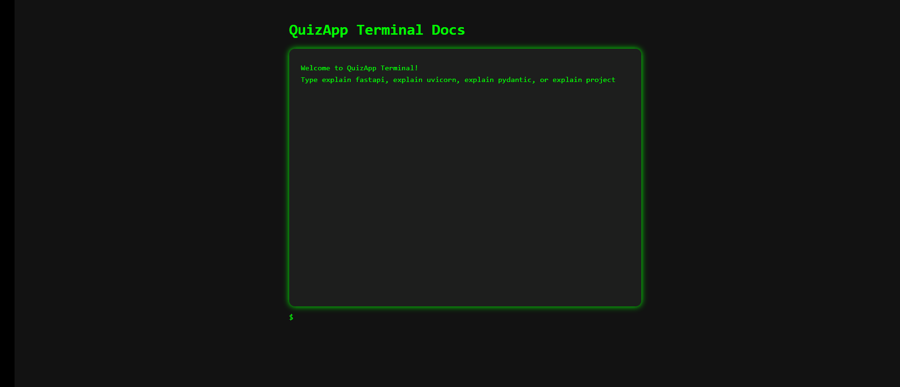

# QuizApp - FastAPI + PostgreSQL

A simple backend project to manage quiz questions and choices, built using **FastAPI**, **SQLAlchemy**, **Pydantic**, and **PostgreSQL**.

This project is beginner-friendly and includes a custom-built **interactive terminal for documentation**, which helps explain how the stack works in a fun way.

---

## 📦 Features

- ✅ Create quiz questions with multiple choices
- ✅ Mark correct answers
- ✅ Retrieve questions and their options
- ✅ Interactive terminal for documentation (`/terminal`)
- ✅ Uses:
  - FastAPI (API framework)
  - SQLAlchemy (ORM for database access)
  - Pydantic (data validation)
  - PostgreSQL (database)
  - Uvicorn (ASGI server)

---

## 🚀 Getting Started

### 1. Clone the Repo

```bash
git clone https://github.com/nuha-95/learn-fastapi-quizapp.git
cd learn-fastapi-quizapp
````

### 2. Install Dependencies

We recommend using a virtual environment:

```bash
pip install -r requirements.txt
```

### 3. Run the App

```bash
uvicorn main:app --reload
```

* The API will be available at: `http://127.0.0.1:8000`
* Swagger/OpenAPI docs: `http://127.0.0.1:8000/docs#/`
* Documentation Terminal: `http://127.0.0.1:8000/terminal`

---

## 📚 API Endpoints

| Method | Endpoint              | Description                        |
| ------ | --------------------- | ---------------------------------- |
| GET    | `/health`             | Health check endpoint              |
| GET    | `/questions/`         | Get all questions                  |
| POST   | `/questions/`         | Create a new question with choices |
| GET    | `/questions/{id}`     | Get a specific question            |
| PUT    | `/questions/{id}`     | Update a question with choices     |
| DELETE | `/questions/{id}`     | Delete a question and its choices  |
| GET    | `/choices/{question}` | Get choices for a question         |
| GET    | `/stats`              | Get database statistics            |
---

## 🧪 Terminal-UI for Documentation

This app includes an interactive documentation page at `/terminal`. It mimics a Linux terminal where you can type commands like:

* `explain fastapi`
* `explain uvicorn`
* `explain pydantic`
* `explain project`

### 🎥 Demo:




---

---

## 🧪 QA Testing & Automation

Comprehensive automated testing suite with **Postman/Newman**, **PyTest**, and **Playwright**.

### 📊 Test Coverage

| Endpoint | Method | Tests |
|----------|--------|---------|
| `/health` | GET | ✅ Status, Schema, Performance |
| `/questions/` | GET | ✅ Array response, Performance |
| `/questions/` | POST | ✅ Valid/Invalid data, Schema |
| `/questions/{id}` | GET | ✅ Valid/Invalid ID, 404 handling |
| `/questions/{id}` | PUT | ✅ Update, Error handling |
| `/questions/{id}` | DELETE | ✅ Delete, Error handling |
| `/choices/{id}` | GET | ✅ Valid/Invalid ID, Schema |
| `/stats` | GET | ✅ Statistics, Data types |

### 🚀 Quick Test Run

```bash
# Install dependencies
pip install -r requirements.txt -r requirements-test.txt
npm install -g newman newman-reporter-htmlextra

# Run tests
bash tests/run_postman_tests.sh    # API tests with Newman ✅
bash tests/run_pytest_tests.sh     # Python API tests ✅
bash tests/run_playwright_tests.sh # UI tests (local)
```

### 📈 Test Reports

- **Postman Reports**: `reports/postman-report.html`
- **PyTest Output**: Console with detailed results
- **Playwright Reports**: `tests/ui/playwright/playwright-report/`

### 🔄 CI/CD Integration

GitHub Actions workflow automatically runs tests on:
- Push to `main`/`develop` branches
- Pull requests
- Generates HTML reports as artifacts
- Combines Postman + PyTest for comprehensive API testing

**Workflows:**
- `.github/workflows/ci-core.yml` - Core API testing ✅ (runs on push/PR)

### 🛠️ Test Structure

```
tests/
├── api/
│   ├── postman/          # Newman/Postman tests
│   └── pytest/           # Python API tests
├── ui/
│   └── playwright/       # Browser UI tests
├── reports/              # Test output reports
└── *.sh                  # Local test runners
```

See `tests/README.md` for detailed testing documentation.

---

## 💡 Future Improvements

* Add user authentication
* Add quiz scoring
* Add frontend for users to take the quiz
* Add pagination & filtering support for questions
* Add performance testing with load tests
* Add security testing with OWASP checks

---


