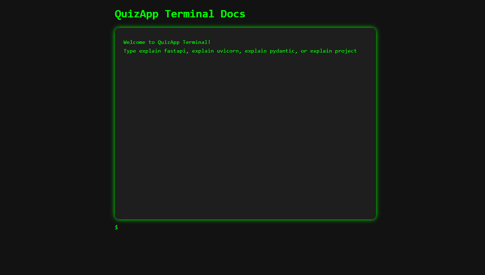

# QuizApp - FastAPI + PostgreSQL

A simple backend project to manage quiz questions and choices, built using **FastAPI**, **SQLAlchemy**, **Pydantic**, and **PostgreSQL**.

This project is beginner-friendly and includes a custom-built **interactive terminal-style documentation UI**, which helps explain how the stack works in a fun way.

---

## 📦 Features

- ✅ Create quiz questions with multiple choices
- ✅ Mark correct answers
- ✅ Retrieve questions and their options
- ✅ Interactive terminal for documentation (`/terminal`)
- ✅ Uses:
  - FastAPI (API framework)
  - SQLAlchemy (ORM for database access)
  - Pydantic (data validation)
  - PostgreSQL (database)
  - Uvicorn (ASGI server)

---

## 🚀 Getting Started

### 1. Clone the Repo

```bash
git clone https://github.com/nuha-95/learn-fastapi-quizapp.git
cd learn-fastapi-quizapp
````

### 2. Install Dependencies

We recommend using a virtual environment:

```bash
pip install -r requirements.txt
```

### 3. Run the App

```bash
uvicorn main:app --reload
```

* The API will be available at: `http://127.0.0.1:8000`
* Swagger/OpenAPI docs: `http://127.0.0.1:8000/docs#/`
* Documentation Terminal: `http://127.0.0.1:8000/terminal`

---

## 📚 API Endpoints

| Method | Endpoint              | Description                        |
| ------ | --------------------- | ---------------------------------- |
| GET    | `/questions/{id}`     | Get a specific question            |
| GET    | `/choices/{question}` | Get choices for a question         |
| POST   | `/questions/`         | Create a new question with choices |

---

## 🧪 Terminal-UI for Documentation

This app includes an interactive documentation page at `/terminal`. It mimics a Linux terminal where you can type commands like:

* `explain fastapi`
* `explain uvicorn`
* `explain pydantic`
* `explain project`

### 🎥 Demo:




---

## 💡 Future Improvements

* Add user authentication
* Add quiz scoring
* Add frontend for users to take the quiz
* Add pagination & filtering support for questions

---


